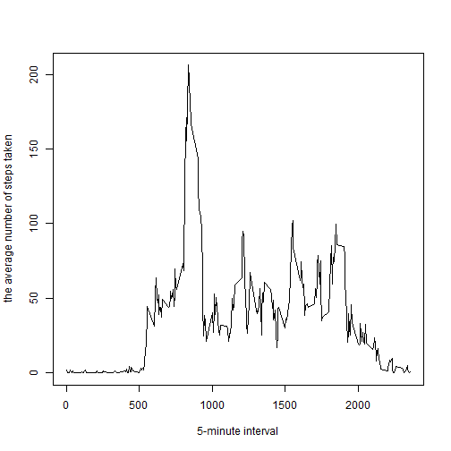

# Reproducible Research: Peer Assessment 1


## Loading and preprocessing the data
- The data is transformed from a **data.frame** format to a **matrix** format, with the rows as the intervals and the columns as the dates.

```r
data = read.csv("./data//activity.csv", head = T)
dates = unique(data$date)
data$interval = as.character(data$interval)
intes = unique(data$interval)
data_m = matrix(NA, ncol = length(dates), nrow = length(intes), dimnames = list(intes, 
    dates))
for (i in 1:nrow(data)) {
    datei = data[i, "date"]
    intei = data[i, "interval"]
    data_m[intei, datei] = data[i, "steps"]
}
```

## What is mean total number of steps taken per day?
- A histogram of the total number of steps taken each day

```r
totals = apply(data_m, 2, sum, na.rm = T)
hist(totals, xlab = NULL, main = "Histogram of the total number of steps taken each day")
```

 

- The mean and median total number of steps taken per day

```r
mean(totals)  #the mean 
```

```
## [1] 9354
```

```r
median(totals)  #the median
```

```
## [1] 10395
```


## What is the average daily activity pattern?
- A time series plot of the 5-minute interval (x-axis) and the average number of steps taken, averaged across all days (y-axis)

```r
activity_day = apply(data_m, 1, mean, na.rm = T)
plot(as.numeric(rownames(data_m)), activity_day, type = "l", xlab = "5-minute interval", 
    ylab = "the average number of steps taken")
```

 

- The interval containing the maximum average number of steps across all days.

```r
result_max = which.max(activity_day)
result_max = round(activity_day[result_max], digits = 3)
paste("the interval:", names(result_max), "(with the max average number of steps:", 
    result_max, ")", sep = " ")
```

```
## [1] "the interval: 835 (with the max average number of steps: 206.17 )"
```


## Imputing missing values
- The total number of missing values in the dataset.

```r
sum(is.na(data$steps))
```

```
## [1] 2304
```

- Fill in the missing values by the median one across all days given the specific interval 

```r
for (i in 1:nrow(data_m)) {
    data_m[i, ] = ifelse(is.na(data_m[i, ]), mean(data_m[i, ], na.rm = T), data_m[i, 
        ])
}
```

- A histogram of the total number of steps taken each day.

```r
toals = apply(data_m, 2, sum)
hist(totals, xlab = NULL, main = "Histogram of the total number of steps taken each day")
```

 

- The mean and median total number of steps taken per day

```r
mean(totals)
```

```
## [1] 9354
```

```r
median(totals)
```

```
## [1] 10395
```

In this case, it seems no difference between these values and the the ones in the first part.

## Are there differences in activity patterns between weekdays and weekends?
- Define each day either 'weekend' or 'weekday'

```r
day_define = as.POSIXlt(colnames(data_m))
day_define = weekdays(day_define)
weekends = c("ÐÇÆÚÁù", "ÐÇÆÚÈÕ")
day_define = ifelse(day_define %in% weekends, "weekend", "weekday")
```

- The time series plot for the weekends part data and the weekdays part data

```r
weekday_data = data_m[, day_define == "weekday"]
weekend_data = data_m[, day_define == "weekend"]
weekday_average = apply(weekday_data, 1, mean)
weekend_average = apply(weekend_data, 1, mean)
x = as.numeric(rownames(data_m))
par(mfrow = c(2, 1))
plot(x, weekday_average, xlab = "interval", ylab = "Number of steps", main = "weekday", 
    type = "l", ylim = c(0, 300))
plot(x, weekend_average, xlab = "interval", ylab = "Number of steps", main = "weekend", 
    type = "l", ylim = c(0, 300))
```

 

